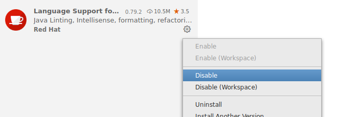
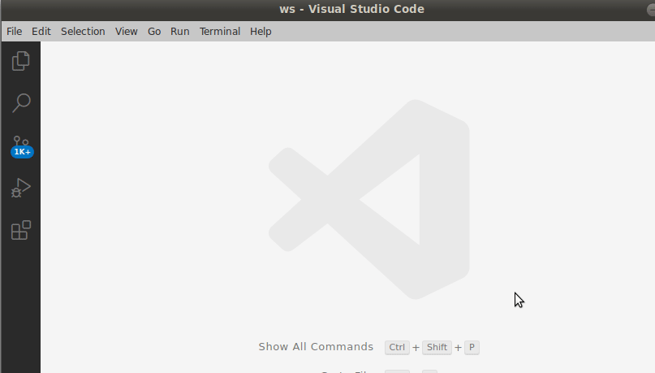
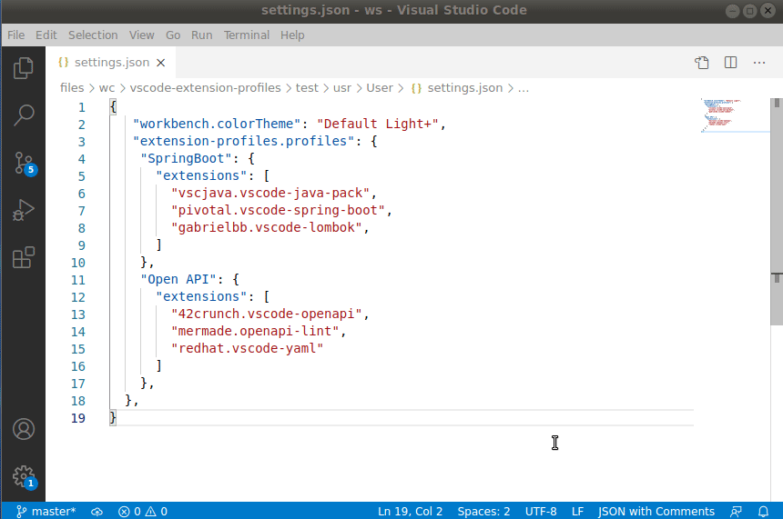

# Extension Profiles

Define sets of extensions that can quickly be enabled in workspaces via settings

## Summary

Do you have extensions you only want enabled for certain workspaces - for example, a set of extensions enabled only for Java projects, and another set enabled only for Python projects, etc?  While VS Code does allow for enabling/disabling extensions in a workspace, it is done manually via the extension sidebar - a process which is slow, error prone, and static.  There is even a popular VS Code feature request to [enable/disable extensions via a configuration file](https://github.com/microsoft/vscode/issues/40239), but it does not appear likely to be implemented anytime soon.

Extension Profiles provides a workaround (within the limitations of the vscode API) to this missing feature!  You define sets of extensions as profiles, and activate different profiles in different workspaces so you can quickly enable the set(s) of extensions you need to different types of projects!

## Usage

1: Install extensions, then disable them globally



2: Define extension profiles in settings.json

```jsonc
    "extension-profiles.profiles": {
      "Spring Boot": { // Extension Profile name
        "extensions": [ // List of extensions that should be enabled
          "vscjava.vscode-java-pack",
          "pivotal.vscode-spring-boot",
          "gabrielbb.vscode-lombok",
        ]
      },
      "Open API": {
        "extensions": [
          "42crunch.vscode-openapi",
          "mermade.openapi-lint",
        ]
      },
    },
```

3: Use "Extension Profiles: Active Profiles Setup" command to activate profiles in workspace

- The active profiles are saved in workspace settings
- Extension sidebar will be displayed with the extensions of the profile displayed.  Manually enable each extension for the workspace



4: If all the workspace's active profile(s) extensions are not enabled (for example, if you add a new extension to a profile), you will be prompted at startup to enable those extensions 



## Additional Features

### Command

From the "Extension Profiles: Active Profiles Setup" command, you can:

  - Activate a profile (as described above)
  - View the extensions for a profile in the extensions sidebar (without activating/deactivating the profile for the workspace)
  - Deactivate a profile (extensions will be displayed in extension sidebar so you can manually disable them)

### Configure Disabled Extensions on Profiles

Profiles can also be configured with extensions that should be disabled.  If there are extensions that should be disabled in the workspace, a popup will notify you along with a button so you can easily disable the extensions on the extension sidebar.

To configure disabled extensions:
```jsonc
    "extension-profiles.profiles": {
      "Java": {
        "extensions": [
          "vscjava.vscode-java-pack"
        ],
        "disabledExtensions": [ // List of extensions that should be disabled
          "noone.bad-extensions-for-java"
        ]
      },
    },
```

### Create keyboard shortcut to directly activate a profile

To configure a keyboard shortcut to active a profile, add to `keybindings.json`:
```json
{
    "key": "ctrl+k ctrl+z",
    "command": "extension-profiles.activate-profile",
    "args": "Spring Boot"
}

```

## Known Limitations

- Extension cannot automatically enabled/disable extensions (vscode API limitation).  As a workaround, the extension sidebar search is used to display the list of extensions so you can quickly enable/disable extensions in a workspace
- The extension sidebar search has a limitation of 200 characters (additional characters after the 200th are not considered for the search).  A warning message will be displayed if this occurs
