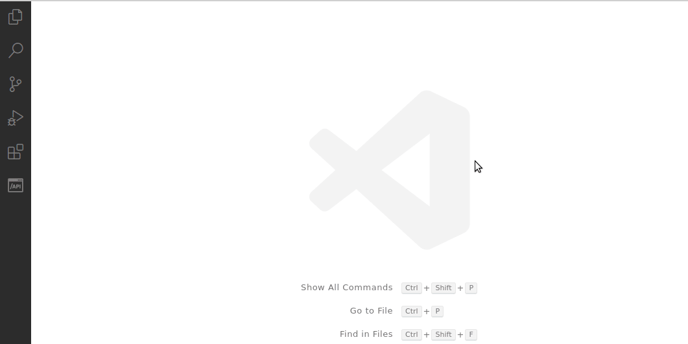
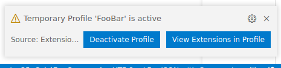

# Extension Profiles 3000

Define sets of extensions that can quickly be enabled in workspaces via settings

## Summary

Do you have extensions you *only* want enabled for certain workspaces?  For example, a set of extensions enabled only for Java projects, and another set enabled only for Python projects, etc?

VS Code does allow enabling/disabling extensions in a workspace manually. But you must remember which extensions you want enabled for each type of workspace (for example, Java), and then scroll through the list of *all* installed extensions to find the ones you want to enable (while hoping you don't miss any).  And if you add a new Java extension, you have to remember to enable it in all your existing Java workspaces.  Do you wish there was a way to define groups of extensions that can be enabled in a workspace together quickly and consistently?  And to be able to modify these groups of extensions, and have existing workspaces updated?

If so, then Extension Profiles 3000 may be the solution you are looking for!  Extension Profiles 3000 allows you to disable extensions globally, and then enable them quickly in the workspaces you want. How it works is:

- First, you globally disable the extensions you do not want enabled in all workspaces
- Next, you define extension profiles (groups of extensions you want to enable together) in your user settings
- Then, you open a workspace and activate an extension profile.  Any extensions defined in the activated profile which are not enabled in the workspace will be automatically displayed on the extension sidebar, so you can quickly enable them all for that workspace
- And each time the workspace is opened, if any extensions for the workspace's active profiles are not enabled (for example, if a new extension was added to the profile), a warning message will be displayed with a prompt to enable those extensions

Additional features include:

- Workspaces can have multiple active profiles
- View the extensions in a profile without saving the profile as active
- Deactivate a profile in a workspace
- Define extensions that should be disabled as part of a profile
- Define settings that should be set on the workspace as part of a profile
- Define profiles as temporary, so provide notification to deactivate the profile
- Ability to create a keyboard shortcut to activate a specific profile


## Extension Profiles 3000 Goal

The goal of Extension Profiles 3000 is to provide a solution to easily enable/disable groups of extensions using only the VS Code API.

There is a popular VS Code feature request to [enable/disable extensions via a configuration file](https://github.com/microsoft/vscode/issues/40239), however it does not appear likely to be implemented anytime soon.

There are other extensions and workarounds to provide similar functionality in a more automated way, however they work by manipulating the VS Code extensions folder or directly modifying the VS Code internal User data.

By using only the VS Code API, Extension Profiles 3000 provides a solution to easily manage enabling/disabling self-defined groups of extensions without impacting the stability in your VS Code installation.

## Usage

1: Install extensions, then disable them globally


2: Define extension profiles in settings.json

```jsonc
    "extension-profiles.profiles": {
      "Spring Boot": { // Extension Profile name
        "extensions": [ // List of extensions that should be enabled
          "vscjava.vscode-java-pack",
          "pivotal.vscode-spring-boot",
          "gabrielbb.vscode-lombok",
        ]
      },
      "Open API": {
        "extensions": [
          "42crunch.vscode-openapi",
          "mermade.openapi-lint",
        ]
      },
    },
```

3: Use "Extension Profiles: Active Profiles Setup" command to activate profiles in workspace

- The active profiles are saved in workspace settings
- Extension sidebar will be displayed with the extensions of the profile displayed.  Manually enable each extension for the workspace


4: If all the workspace's active profile(s) extensions are not enabled (for example, if you add a new extension to a profile), you will be prompted at startup to enable those extensions 


## Additional Features

### Command Pallete

From the "Extension Profiles: Active Profiles Setup" command, you can:

  - Activate a profile (as described above)
  - View all the extensions for a profile in the extensions sidebar (without activating/deactivating the profile for the workspace)
  - Deactivate a profile

### Disabled Extensions on Profiles

Profiles can also be configured with extensions that should be disabled.  If there are extensions that should be disabled in the workspace, a popup will notify you along with a button so you can easily disable the extensions on the extension sidebar.

To configure disabled extensions:
```jsonc
    "extension-profiles.profiles": {
      "Java": {
        "extensions": [
          "vscjava.vscode-java-pack"
        ],
        "disabledExtensions": [ // List of extensions that should be disabled
          "noone.bad-extensions-for-java"
        ]
      },
    },
```


### Workspace settings on Profiles

Profiles can be configured with settings that should be set on the workspace (or on all workspace folders) when the profile is active.

When profile is activated, an editor will be opened to prompt you if there are any profile settings that need to be set.  And when the workspace is opened, a popup will notify if there are any profile settings that need to be set.

```jsonc
    "extension-profiles.profiles": {
      "Java": {
        "extensions": [
          "vscjava.vscode-java-pack",
          "SonarSource.sonarlint-vscode"
        ],
        "settings": {
          "sonarlint.connectedMode.project": {
            "projectKey": "GET PROJECT KEY FROM POM" // can use value as reminder of what the value should be - it is only used in the prompt if the setting needs to be set
          }
        }
      },
    },
```



### Temporary Profiles

If you have a profile you only don't always want enabled, it can be set as a temporary profile.  When the workspace is opened, if there are any temporary profiles active a popup will notify you and allow you to disable them.

```jsonc
    "FooBar": {
        "extensions": [
            "example.extension-i-dont-want-enabled-all-the-time"
        ],
        "temporaryProfile": true
    },
```



### Create keyboard shortcut to directly activate a profile

To configure a keyboard shortcut to active a profile, add to `keybindings.json`:
```json
{
    "key": "ctrl+k ctrl+z",
    "command": "extension-profiles.activate-profile",
    "args": "Spring Boot"
}

```

## Known Limitations

- The extension sidebar search has a limitation of 200 characters.  When activating or viewing a profile, the extension search will broken into searches of less than 200 characters.  A popup message will notify if there are additional extensions to display and include a button to execute the next search.


